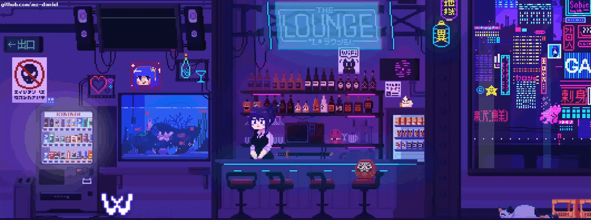

---

-
-
-
- :books: Currently an Information Systems student at the Federal University of Sergipe seeking to extract the best of the worlds.
- 🔭 I’m currently learning <b>how to be better</b>
- :busts_in_silhouette: I’m looking to collaborate on <a href="https://github.com/marcosdosea/AgendeMe">AgendeMe</a>
-
-
-
-

---

 <!-- contribuições/commits/etc  --> 
 
 
  <!-- contador de linguagem  --> 
 
 

