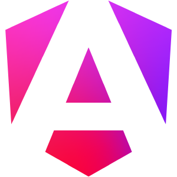
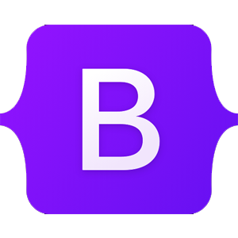
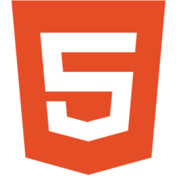
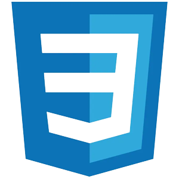
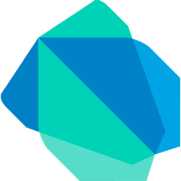
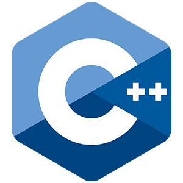
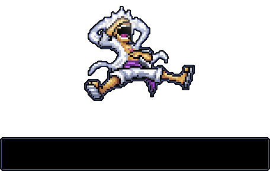

---
 

## 📝About Me
- :books: Hello! My name is Carlos Daniel and I have a degree in Information Systems from the Federal University of Sergipe. I am a Full Stack developer focused on stacks such as .Net, Laravel, Angular and React.  
- 🔭 Currently learning <b>how to be BETTER</b>  
- 🚀 Contributing to the <a href="https://github.com/marcosdosea/AgendeMe">AgendeMe</a> project (.Net, ASP.NET, MySQL, Entity Framework, Identity...)   
- 🛠️ See my actual project with Laravel + Angular + Tailwind:  <a href="https://github.com/ms-daniel/Gerencia-de-Estoque">Inventory Management</a> 
- 🛠️ And Customer registration with React + ASP.NET API in <a href="https://github.com/ms-daniel/Cadastra-Clientes" target="_blank">Customers Register</a> 
- See Also: <a href="https://github.com/marcosdosea/GestaoGrupoMusical" target="_blank">Gestão de Grupo Musical</a>, <a href="https://github.com/ms-daniel/JogoDaVelha" target="_blank">Jogo da Velha Online(Java)</a>, <a href="https://github.com/ms-daniel/JogoDaVelha" target="_blank">RL - Labirinto(Java)</a> 
  
---

  <h1> 🚀 Skills 🚀 </h1>
  

   Legend:  
   ✯ - Main ✦ - Knowledge ☻ - Learning
  

  <h2> Frameworks </h2>
  ✯
  <code></code>
  <code></code>
  <code></code>
  <code></code>
  <code></code>
   
  ✦
  <code></code>
  <code></code>
  <code></code>
  <code></code>
  <code></code>
  <code></code>

  <h2> Stack/Technologies </h2>
  ✯
  <code></code>
  <code></code>
  <code></code>
  <code></code>
  <code></code>
  <code></code>
  <code></code>
   
  ✦
  <code></code>
  <code></code>
  <code></code>

  <h2> Databases SQL/NoSQL </h2>
  ✯
  <code></code>
  <code></code>
  <code></code>
  <code></code>
   
  ✦
  <code></code>
  <code></code>
  <code></code>

---

 <!-- contribuições/commits/etc  --> 
 
 
  <!-- contador de linguagem  --> 
 
<!--&border_color=1E90FF-->

 ---

## Contact

 
 
 
 

---

 
 

